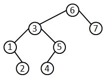

<!-- Tree Traversal -->
## Task Description ##

Given the root of a binary tree and a series of N commands, write a function `traversal` to traverse the tree and output the result.


The node is given by a structure Node.
```c
typedef struct Node {
    int label;
    struct Node *left, *right;
} Node;
```
There are six types of commands, and the command type $t$ is an integer from $0$ to $5$. Let the current node of the tree be root:
* $t = 0$ - stop traversing and print the label of the current node.
* $t = 1$ - print the label of the current node.
* $t = 2$ - go to the parent of the current node.
* $t = 3$ - go to the left child of the current node.
* $t = 4$ - go to the right child of the current node.
* $t = 5$ - go to the sibling of the current node. The sibling is the other node that have the same parent as you do. For example, in the picture above node $1$ and $5$ are siblings.

A command is invalid if the destination node specified does not exist.  An invalid command will stop the traversal and your program should print the label of the current node and ignore the rest of the commands.

The prototype of the function you need to implement is as follows:
```c
void traversal(Node *root, int N, int command[]);
```
## Hint ##
You can use an array to store the address of nodes along the path from the root to the current node. Then all the operations are very easy.

## Header and Main Program ##
### tree.h ###
```c
#ifndef _TREE_H
#define _TREE_H

typedef struct Node {
    int label;
    struct Node *left, *right;
} Node;
 
void traversal(Node *root, int N, int command[]);


#endif
```
### main.c (test) ###
```c
#include "tree.h"
#include <stdio.h>
#include <stdlib.h>
#define MAX 1000 

Node* newNode(int label, Node *l, Node *r) {
    Node *u = (Node *) malloc(sizeof(Node));
    u->label = label, u->left = l, u->right = r;
    return u;
}
 
int main() {
    Node *root = newNode(
            6,
            newNode(
                3,
                newNode(1, 
                        NULL, 
                        newNode(2, NULL, NULL)
                        ),
                newNode(5, 
                        newNode(4, NULL, NULL), 
                        NULL
                        )                
            ),
            newNode(
                7,
				NULL,
                NULL                
            )
    );

    int N, command[MAX];
    scanf("%d", &N);
    for(int i = 0; i < N; i++) {
        scanf("%d", &command[i]);        
    }
    traversal(root, N, command);
    return 0;
}
```
### Compile ###

```
gcc -std=c99 -O2 tree.c main.c -lm
```
## Input Format ##
The input tree will be given as a pointer to the root and $N$ commands.

* $0 < N < 1000$
* $0 \leq t \leq 5$

## Output Format ##
Print the label of current node if the command is $1$ and the label of the last node before you stop the travelsal on separate lines.
## Sample Input1 ##
```
6
3 4 5 2 2 0
```
## Sample Output1 ##
```
6
```
## Sample Input2 ##
```
10
4 5 2 1 3 4 3 1 5 0
```
## Sample Output2 ##
```
6
4 
4
```
