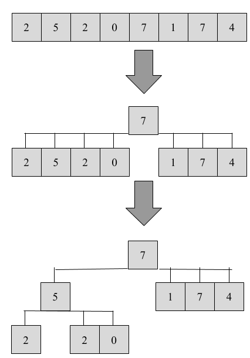

## Task Description ##

Write a program to build a seesaw chandelier.

A seesaw chandelier is a hierarchy of seesaws in which every seesaw is balanced. A seesaw chandelier has another seesaw chandelier on the left, a balancing point, and another seesaw chandelier on the right.

We want to build a seesaw chandelier from a sequence of n non-negative integers, indexed from $0$ to $n-1$. For the first level, we consider the whole sequence as a seesaw and find the balancing point at index $i$ between $0$ to $n-1$, as we did in the previous exam task.  Now there are two partitions -- one on the left and one on the right. The one on the left with index from $0$ to $i-1$, and the one on the right has index from $i+1$ to $n-1$.  Now we consider these two partitions as two independent seesaw hierarchies and find the balancing points for them. We can recursively do this until the length is less than $3$, or we cannot find a balancing point for a partition. In both cases we stop the recursion.

For example, we now want to build a seesaw chandelier with a sequence of 8 non-negative integers, $(2,5,2,0,7,1,7,4)$. At the first level, we can find the balancing point at 7 (with index 4), because $2\times 4+5\times 3+2\times 2+0\times 1=1\times 1+7\times 2+4\times 3$.  Then we partition the sequence into two sequences, $(2,5,2,0)$ and $(1,7,4)$.  Then we recursively find the balancing points for them. We can find 5 (index 1) for the partition on the left, because $2\times 1=2\times 1+0\times 2$.  But no balancing point on the right.  After that the recursion stops since we cannot find a balancing point for the new partitions. 



Note that there is only one balancing point since there is only one center of mass for every seesaw. In addition, the torque need to be stored in a “long long int” to prevent integer overflow.  It is guaranteed that there exists a balancing point at the top (the first) level of the seesaw hierarchy.

After building the seesaw chandelier please output all the indices of balancing points from left to right.  For the example above, you should output 1, 4.


## Subtask ##

- 10 points: It is guaranteed you can only find the balancing point at the top level, and none at the second level.
- 20 points: It is guaranteed you can only find the balancing point at the top and the second level, and none at the third level.
- 70 points: It is guaranteed you can find the balancing point at the top, but nothing is guaranteed at other levels.


## Input Format ##

The input contains only one test case.  The first line contains one integers n, representing the number of sequence.  The second line contains n integers, $w_{1}$, $w_{2}$, … , $w_{n}$, representing the weights of index.

- 0 < n < 16384

## Output Format ##

Print all the indices of balancing points from left to right, and an index in a line.

## Sample Input 0 ##

```
3
1 0 0

```

## Sample Output 0 ##

```
0

```

## Sample Input 1 ##

```
4
2 1 5 5

```

## Sample Output 1 ##

```
2

```

## Sample Input 2 ##

```
9
2 5 2 0 7 1 1 4 3

```

## Sample Output 2 ##

```
1
4
7

```

## Sample Input 3 ##

```
8
2 5 2 0 7 1 7 4

```

## Sample Output 3 ##

```
1
4

```
