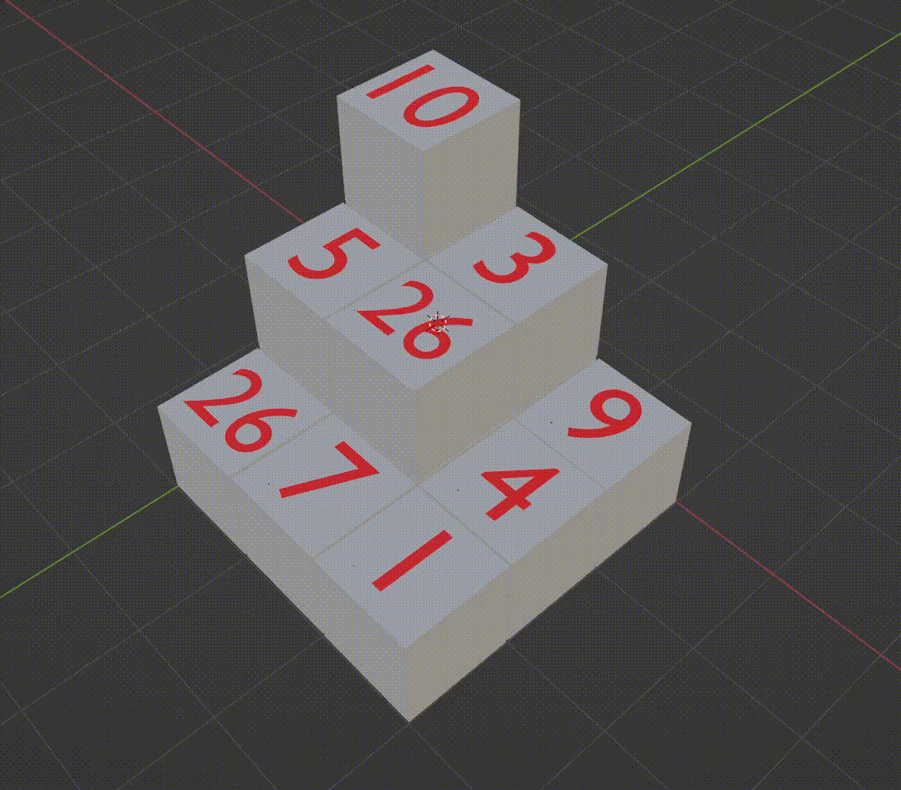

## Task Description ##
There are $1^2 + 2^2 + ... + N^2 = N(N+1)(2N+1)/6$ cubics that stack as a tower. 
The tower has $N$ layers, and the $i$-th layer has $i^2$ cubics.
Each cubic has a number. 
A cubic is *exposed* if it does not have a cubic on top of it.
Now we start to find two exposed cubics with the same number $k$ and remove them.
This process will expose exactly two new cubics, and we will repeatedly remove any pair of exposed cubics with the same number until all exposed cubics have different numbers.
For simplicity, we guarantee that, at most *one* pair of exposed cubics will have the same number before and after removing the pair.
Please refer to the following illustration.



Note that you can use a hash table to speed up the process of determining if the newly exposed cubics have the same number as any previously existing exposed cubics. In addition, you need to implement deletion in the hash table to prevent from the number of elements in the table exceeding the capacity $C$.

## Subtask ##
* 50pt. You can use simple comparisons for this task.
* 50pt. You need to use a hash table to speed up this task, or you may get a TLE.

## Hash Function ##
$k$ represents the input key.

$S$ is the size of hash table.

$f$ is the hash function that indicates $f(k) = (77*k+2222)$ mod $S$.


## Input ##
The first line contains $N$, $S$, and $C$.
$S$ is the size of the hash table.
$C$ is the capacity of each index in the hash table.
The following inputs are tower numbers.
There are N sections representing N layers.
The first section has only 1 number.
The second section has 2 lines that each line has 2 numbers.
.
.
.
Until section N, it has N lines with each line having N numbers.
* $1 \leq N \leq 105$
* $1 \leq S \leq N^2$
* $1 \leq C \leq 10$
* $1 \leq k \leq 20000000$

## Output ##

The output consists of the removed numbers in order.

## Sample input 1 ##
```
3 9 10
10
3 3
5 26
11 5 9
7 10 4
26 7 1
```

## Sample output 1 ##
```
26 10 3 5 7
```

## Estimated Cyclomatic Number ##
```
16.3
```
